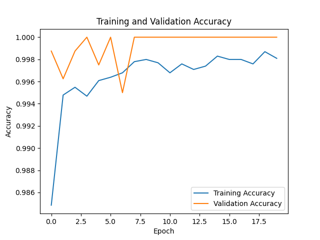

# Face Mask Detection Project 👀😷

## 👁️‍🗨️ Overview
This project focuses on detecting face masks using a combination of YOLOv8 for face detection and Xception for face mask classification.

## 🛠️ Prerequisites
- Python 3.x
- TensorFlow
- Ultralytics (YOLOv8)
- OpenCV
- Matplotlib

## 🚀 Getting Started
1. Clone the repository.
2. Install the required dependencies using `pip install -r requirements.txt`.
3. Run the face mask detection script using `python face_mask_detection.py`.
4. Press 'q' to exit the detection window.

## 📂 Project Structure
- `face_mask_detection.py`: Main script for face mask detection.
- `face_mask2.h5`: Pre-trained face mask detection model.
- `yolov8l-face.pt`: Pre-trained YOLOv8 model for face detection.

## 🖥️ Usage
1. Ensure your webcam is connected.
2. Run the script.
3. The detection window will display live webcam feed with face mask detection.

## 📊 Results
Check the `DETECTION_IMAGES` folder for sample images with face mask detection.

## 📈 Evaluation
The training history and evaluation plots are available in the `face-mask.csv` file.

### 📉 Evaluation Plots

| **Training and Validation Loss** | **Training and Validation Accuracy** |
|:-------------------------:|:-------------------------:|
|  |  |

| **Training and Validation Precision** | **Training and Validation Recall** |
|:-------------------------:|:-------------------------:|
|  |  |

## 🙌 Acknowledgments
- YOLOv8: [Ultralytics](https://github.com/ultralytics/ultralytics)
- YOLOv8l-face and YOLOv8n-face checkpoints [checkpoints](https://github.com/akanametov/yolov8-face)
- Xception: [Keras Applications](https://keras.io/api/applications/xception/)
- Face Mask Dataset - [DATASET-1](https://www.kaggle.com/datasets/ashishjangra27/face-mask-12k-images-dataset/data) 
- DETECTION_IMAGES - [DATASET-2](https://www.kaggle.com/datasets/andrewmvd/face-mask-detection)

Feel free to contribute and improve this project! 🚀
